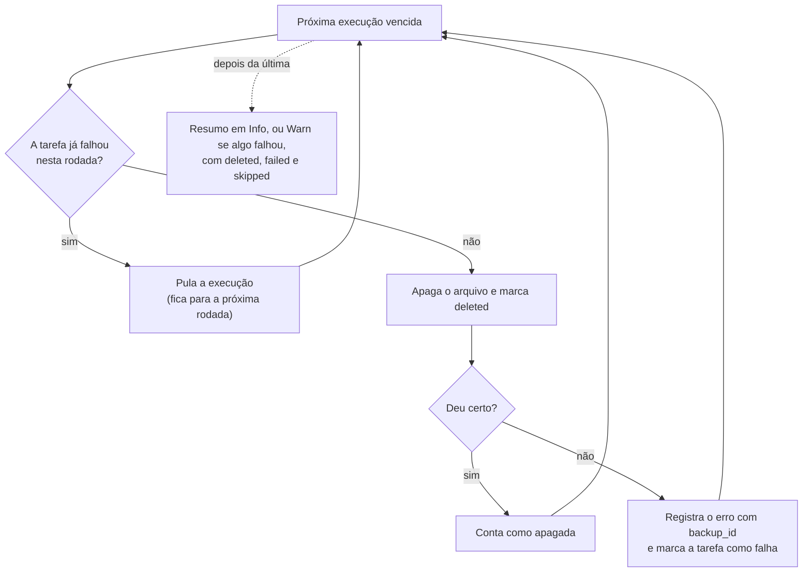

# Plano #14 — limpeza da retenção não pode parar no primeiro erro

Issue: [#14](https://github.com/tuanmedeiros/pgbackweb-eduardolat/issues/14) ·
Branch: `fix/retention-cleanup-continues` · Base: `78946bc` (`main` com o #13)

Este arquivo é o plano vivo da correção: a tabela de tarefas e o histórico são
atualizados conforme o trabalho avança.

## Contexto

A limpeza da retenção desiste da lista inteira no primeiro backup que não consegue
apagar, então um destino com problema trava a retenção de todas as outras tarefas.

```go
for _, execution := range expiredExecutions {
    if err := s.SoftDeleteExecution(ctx, execution.ID); err != nil {
        logger.Error("error soft deleting expired executions", ...)
        return // abandona todos os itens seguintes
    }
}
```

- **Onde:** `internal/service/executions/soft_delete_expired_executions.go`, o
  `return` dentro do `for`.
- **Origem:** código do upstream de 21/07/2024 (commits `7e2ceab` e `b98df7b`),
  igual até hoje no `upstream/main`. Não foi introduzido pelo fork.
- **Quando roda:** na subida do app e a cada 10 minutos (`cmd/app/init_schedule.go`).
- **Efeito:** nenhum dado é perdido. Os buckets das tarefas saudáveis crescem sem
  limite enquanto o item quebrado estiver na frente da lista, e o único sinal é uma
  linha de erro no log.

## Objetivo e critérios de aceite

Um backup que não pode ser apagado passa a atrasar só a própria tarefa, nunca as
outras. O PR está pronto quando todos os critérios abaixo forem demonstrados por
teste ou por execução real.

1. **Isolamento:** uma falha ao apagar uma execução não impede que as execuções das
   outras tarefas sejam apagadas na mesma rodada.
2. **Custo limitado por tarefa:** depois da primeira falha de uma tarefa numa rodada,
   as outras execuções dessa tarefa são puladas até a próxima rodada. Um destino
   quebrado custa no máximo uma tentativa por tarefa a cada 10 minutos.
3. **Arquivo local que já sumiu conta como apagado:** apagar um backup local cujo
   arquivo não existe mais marca a execução como `deleted`, do mesmo jeito que o S3
   responde a uma chave inexistente. Isso também vale para a exclusão manual pela
   interface.
4. **Log honesto:** cada falha é registrada com `execution_id` e `backup_id`. O fim
   da rodada informa quantas foram apagadas, quantas falharam e quantas foram
   puladas, e deixa de dizer "soft deleted" como sucesso quando algo falhou.
5. **Sem mudança quando nada falha:** a query de seleção (a do mínimo de cópias) não
   muda, e o resultado de uma rodada sem erros continua igual.

## Análise do código atual

Trocar o `return` por `continue` não basta: duas das falhas possíveis são
permanentes, e uma delas pode levar minutos por tentativa. Todas nascem dentro de
`SoftDeleteExecution`, que a limpeza chama item a item.

| Onde falha                                          | Exemplo                         | Natureza                                                                                                                  | Efeito hoje                                                     |
| --------------------------------------------------- | ------------------------------- | ------------------------------------------------------------------------------------------------------------------------- | --------------------------------------------------------------- |
| `S3Delete`                                          | chave revogada, bucket removido | permanente até alguém corrigir                                                                                            | trava a rodada inteira                                          |
| `S3Delete`                                          | endpoint fora do ar ou lento    | transitória, mas cada tentativa pode esperar até `PBW_DESTINATION_RESPONSE_TIMEOUT` (5 min) vezes as re-tentativas do SDK | trava a rodada, e pode segurá-la por horas                      |
| `LocalDelete`                                       | o arquivo não existe mais       | permanente: `os.Remove` sempre responde "no such file"                                                                    | trava a rodada, e a exclusão manual pela interface também falha |
| `LocalDelete`                                       | permissão negada                | permanente até corrigir                                                                                                   | trava a rodada inteira                                          |
| Banco (`GetExecutionForSoftDelete`, marcar deleted) | conexão caiu                    | transitória                                                                                                               | trava a rodada inteira                                          |

O arquivo local ausente é o caso mais provável. Quando um backup local falha antes de
criar o arquivo (em `MkdirAll` ou `os.Create`), `run_execution.go` grava o `path`
mesmo assim. Um volume `/backups` sem persistência, recriado num redeploy, deixa todas
as execuções locais nessa situação.

Padrões do repositório que a correção segue:

- **Jobs em lote registram o erro do item e seguem:** `TestAllDatabases`,
  `TestAllDestinations` e `ScheduleAll` já fazem assim. A limpeza é o único job que
  desiste.
- **Log:** `logger.Error`, `logger.Warn` e `logger.Info` com `logger.KV`, chaves em
  snake_case (`backup_id`, `database_id`). A camada de storage já registra log
  (`s3.go`).
- **Estrutura:** um arquivo Go por operação. Nenhum SQL novo, então `dbgen` não muda.
- **Testes:** table-driven com `t.Run` e `t.Helper()`. Testes que dependem de
  infraestrutura são pulados sem ela, como `TestGetExpiredExecutions`.
- **Outro chamador:** `SoftDeleteExecution` também atende a exclusão manual
  (`internal/view/web/dashboard/executions/soft_delete_execution.go`), então o que
  mudar nele muda a interface junto.

## Desenho da solução

São três mudanças pequenas em dois arquivos Go existentes, sem SQL, sem migration e
sem mudança de interface.

1. **O loop segue em frente e pula a tarefa que falhou.** O loop sai do método e vira
   uma função não exportada no mesmo arquivo, que recebe a função de exclusão como
   parâmetro. O método passa `s.SoftDeleteExecution`, e o teste passa uma função
   falsa, sem banco e sem S3. É isso que deixa o comportamento testável no CI do
   GitHub.
2. **`LocalDelete` trata "arquivo não existe" como sucesso**
   (`errors.Is(err, fs.ErrNotExist)`). O objetivo da chamada é que o arquivo não
   exista, e ele já não existe. É o mesmo contrato do `DeleteObject` do S3. Outros
   erros (permissão, disco) continuam sendo erro. O arquivo ausente é registrado em
   `Warn` com o caminho, para que um volume não montado não passe em silêncio.
3. **Logs:** a falha de cada item ganha `backup_id`. O fim da rodada usa `Info`
   quando tudo foi apagado e `Warn` quando algo falhou, sempre com as contagens
   `deleted`, `failed` e `skipped`.



Esboço do núcleo (os nomes podem mudar na implementação):

```go
// softDeleteEach apaga uma a uma. Depois de uma falha, o resto da mesma
// tarefa fica para a próxima rodada: o que quebrou a primeira exclusão
// (chave revogada, destino fora do ar) quebra as outras, e cada tentativa
// pode levar minutos.
func softDeleteEach(
	ctx context.Context, executions []dbgen.Execution,
	del func(context.Context, uuid.UUID) error,
) (deleted, failed, skipped int) {
	failedBackups := map[uuid.UUID]bool{}
	for _, execution := range executions {
		if failedBackups[execution.BackupID] {
			skipped++
			continue
		}
		if err := del(ctx, execution.ID); err != nil {
			logger.Error("error soft deleting expired execution", logger.KV{
				"execution_id": execution.ID.String(),
				"backup_id":    execution.BackupID.String(),
				"error":        err,
			})
			failedBackups[execution.BackupID] = true
			failed++
			continue
		}
		deleted++
	}
	return deleted, failed, skipped
}
```

Alternativas descartadas:

| Alternativa                                                 | Por que não                                                                                                                                                                                      |
| ----------------------------------------------------------- | ------------------------------------------------------------------------------------------------------------------------------------------------------------------------------------------------ |
| Só trocar `return` por `continue` (a sugestão da issue)     | Um destino lento seguraria a rodada por horas (5 min por tentativa, vezes cada backup vencido), atrasando as outras tarefas do mesmo jeito.                                                      |
| Pular por destino, em vez de por tarefa                     | A query devolve só `executions.*`, sem `destination_id`. Mudar isso mexe no SQL do #13 e no tipo gerado. Por tarefa é quase igual: um destino usado por N tarefas custa N tentativas por rodada. |
| Apagar em paralelo com `errgroup`, como `TestAllDatabases`  | Encurta a rodada, mas não limita o custo de um destino quebrado, e multiplica as chamadas a ele.                                                                                                 |
| Marcar como apagado o que falha sempre, ou backoff no banco | Precisa de coluna nova e decide sozinho que um arquivo foi perdido. Fica fora deste PR.                                                                                                          |
| Teste do loop só contra banco real                          | O CI do GitHub não tem Postgres, então o teste seria pulado justamente onde importa.                                                                                                             |

## Etapas e tarefas

São quatro etapas em sequência: o teste vem antes da correção, e a revisão do Codex
vem antes do merge. Status: `A fazer` · `Em andamento` · `Feito` · `Bloqueado`.

| #   | Etapa         | Tarefa                                                                                                        | Status  |
| --- | ------------- | ------------------------------------------------------------------------------------------------------------- | ------- |
| 1   | Preparação    | Branch `fix/retention-cleanup-continues` a partir da `main` (já com o #13)                                    | Feito   |
| 2   | Preparação    | Teste table-driven do loop com função de exclusão falsa, escrito antes da correção e visto falhando           | Feito   |
| 3   | Implementação | Extrair o loop para `softDeleteEach`: seguir depois de uma falha e pular o resto da mesma tarefa na rodada    | Feito   |
| 4   | Implementação | `LocalDelete` aceita arquivo inexistente (com `Warn`), com teste próprio                                      | Feito   |
| 5   | Implementação | Logs: `backup_id` em cada falha e resumo `Info`/`Warn` com as contagens                                       | Feito   |
| 6   | Verificação   | `/ci-local`: lint, test e build na imagem do CI                                                               | Feito   |
| 7   | Verificação   | E2E com o app real: um destino com chave inválida, um saudável e um backup local sem arquivo, na mesma rodada | A fazer |
| 8   | Verificação   | Exclusão manual pela interface de um backup local cujo arquivo sumiu                                          | A fazer |
| 9   | Revisão       | PR aberto como draft, com as decisões na descrição e link para este plano                                     | A fazer |
| 10  | Revisão       | Revisão do Codex (`gpt-5.6-sol`, medium) em ciclos até vir limpa, cada achado registrado em Decisões          | A fazer |
| 11  | Revisão       | `UPSTREAM.md` registra a nova divergência                                                                     | A fazer |
| 12  | Entrega       | Merge na `main` do fork                                                                                       | A fazer |
| 13  | Entrega       | Release com #11 e #14 (`/release-fork`), com autorização do dono                                              | A fazer |

## Plano de testes

Cada teste novo precisa ser visto falhando no código atual antes da correção; teste
que só passa depois não prova nada. Os dois testes unitários rodam no CI do GitHub, e
a parte que depende de banco e S3 é coberta pelo E2E.

**1. `TestSoftDeleteEach`** (`internal/service/executions`, sem banco, table-driven).
Uma função de exclusão falsa registra cada chamada e falha para IDs escolhidos. Casos:

- nada falha: tudo apagado, nada pulado;
- a primeira execução de uma tarefa falha: as outras tarefas são apagadas e o resto
  daquela tarefa é pulado (este caso falha no código atual);
- falha no meio da lista: os itens depois dela continuam sendo tentados;
- todas as tarefas falham: cada tarefa é tentada exatamente uma vez;
- lista vazia: nenhuma chamada, contagens zeradas.

**2. `TestLocalDelete`** (`internal/integration/storage`). Casos:

- arquivo inexistente devolve `nil` (falha no código atual);
- arquivo existente é removido;
- diretório não vazio continua dando erro, provando que só o "não existe" virou
  sucesso.

Os dois últimos casos escrevem em `/backups` e são pulados quando o diretório não é
gravável. Ele existe na imagem do CI, mas não no Mac.

**3. Regressão:** `TestGetExpiredExecutions` (do #13) roda de novo contra o Postgres
e continua passando, e `/ci-local` fica verde em lint, test e build.

**4. E2E com o app real** (binário do `/ci-local`, Postgres 16, MinIO). Três tarefas
com backups vencidos na mesma rodada:

- tarefa A com chave inválida;
- tarefa B saudável;
- tarefa C local cujo arquivo foi apagado à mão.

Primeiro no binário da `main`, para registrar o travamento. Depois no da branch,
esperando:

- os arquivos de B saem do bucket;
- A tem uma falha e o resto pulado;
- C é marcada como `deleted`;
- o log termina com `Warn` e as contagens.

**5. Interface:** apagar à mão uma execução local cujo arquivo sumiu. Hoje dá erro, e
depois da correção deve funcionar.

## Resultados

Os testes unitários rodaram na imagem do CI (`pgbackweb-dev:local`), primeiro contra
o comportamento atual e depois contra a correção.

`softDeleteEach` não existe no código atual, então o teste não compilaria contra ele,
e erro de compilação não prova nada. Por isso o loop foi primeiro extraído sem mudar
o comportamento (o mesmo `return` no primeiro erro, o mesmo log), o teste rodou contra
essa extração, e só depois veio a correção (decisão 6).

| Teste                                                           | Comportamento atual | Com a correção |
| --------------------------------------------------------------- | ------------------- | -------------- |
| `TestSoftDeleteEach` / nada falha                               | passa               | passa          |
| `TestSoftDeleteEach` / a tarefa que falha não para as outras    | **falha**           | passa          |
| `TestSoftDeleteEach` / itens depois de uma falha são tentados   | **falha**           | passa          |
| `TestSoftDeleteEach` / tarefa que falha depois mantém o apagado | **falha**           | passa          |
| `TestSoftDeleteEach` / cada tarefa que falha é tentada uma vez  | **falha**           | passa          |
| `TestSoftDeleteEach` / lista vazia                              | passa               | passa          |
| `TestLocalDelete` / arquivo inexistente conta como apagado      | **falha**           | passa          |
| `TestLocalDelete` / arquivo existente é removido                | passa               | passa          |
| `TestLocalDelete` / diretório não vazio continua dando erro     | passa               | passa          |

Os casos que passam nos dois lados são os que o código atual já acerta; ficam como
guarda de regressão. No comportamento atual, a falha do caso principal foi
`expected: [a1 b1 c1]`, `actual: [a1]`: nada depois da primeira falha foi tentado. A
do `LocalDelete` foi `remove /backups/pbw-test-…/missing.zip: no such file or
directory`.

Com a correção, cada falha sai com `execution_id` e `backup_id`, e o arquivo ausente
sai em `Warn` com o caminho:

```json
{"level":"ERROR","msg":"error soft deleting expired execution","backup_id":"4d9d90c2-…","error":"destination unavailable","execution_id":"5872e6ae-…"}
{"level":"WARN","msg":"local backup file to delete does not exist","path":"/backups/pbw-test-706c0ba1-…/missing.zip"}
```

Verificação completa:

- `/ci-local`: `task lint`, `task test` e `task build` com exit 0 na imagem do CI.
- `TestGetExpiredExecutions` (do #13) contra um Postgres 16 descartável, migrado com
  `task goose -- up` até `20260925000001`: 7/7 passam. A query não mudou.

## Riscos e fora de escopo

O único risco novo vem de aceitar arquivo local inexistente, e o pior caso dele é
arquivo órfão no disco, nunca backup perdido.

| Risco                              | Quando acontece                                                            | Consequência                                                                                                                   | Mitigação                                                                                       |
| ---------------------------------- | -------------------------------------------------------------------------- | ------------------------------------------------------------------------------------------------------------------------------ | ----------------------------------------------------------------------------------------------- |
| Volume `/backups` não montado      | o container sobe sem o volume, e todos os arquivos locais parecem ausentes | as execuções locais **vencidas** são marcadas `deleted` enquanto os arquivos continuam no volume real, virando órfãos no disco | o mínimo de cópias do #13 protege as mais recentes; cada arquivo ausente é registrado em `Warn` |
| Falha pontual numa tarefa saudável | um erro isolado de rede ou de banco                                        | o resto daquela tarefa espera 10 minutos pela próxima rodada                                                                   | nenhuma necessária: é atraso, não perda                                                         |
| Tarefa quebrada para sempre        | ninguém corrige a chave ou o destino                                       | uma linha de erro a cada 10 minutos, como hoje, mas sem afetar as outras tarefas                                               | o `Warn` de resumo com `failed > 0` facilita criar alerta no log                                |

Fora de escopo deste PR:

- avisar por webhook quando a limpeza falha (bom candidato a issue separada);
- backoff ou marcação no banco para execuções que falham sempre;
- execuções órfãs em `running` depois de um redeploy (issue #9);
- propor a correção ao upstream, que depende de pedido explícito.

## Registro de decisões

Cinco decisões de desenho foram tomadas no planejamento. Cada achado da revisão do
Codex entra nesta tabela com veredito e motivo, inclusive os rejeitados.

| #   | Origem        | Decisão                                                              | Veredito                                    | Por quê                                                                                                                                                                                                                                                              |
| --- | ------------- | -------------------------------------------------------------------- | ------------------------------------------- | -------------------------------------------------------------------------------------------------------------------------------------------------------------------------------------------------------------------------------------------------------------------- |
| 1   | Planejamento  | Depois da primeira falha de uma tarefa, pular o resto dela na rodada | adotada                                     | Sem isso, um destino lento seguraria a rodada por horas e atrasaria as outras tarefas, que é o problema original.                                                                                                                                                    |
| 2   | Planejamento  | Pular por tarefa, não por destino                                    | adotada                                     | A query não devolve `destination_id`, e mudá-la mexeria no SQL do #13 e no tipo gerado.                                                                                                                                                                              |
| 3   | Planejamento  | `LocalDelete` aceita arquivo inexistente neste mesmo PR              | adotada, confirmada pelo dono em 29/09/2026 | É a falha permanente mais provável, usa o mesmo contrato do S3 e destrava a exclusão manual pela interface.                                                                                                                                                          |
| 4   | Planejamento  | Loop extraído numa função que recebe a exclusão como parâmetro       | adotada                                     | Deixa o comportamento testável no CI do GitHub sem banco, sem interface nova e sem biblioteca de mock.                                                                                                                                                               |
| 5   | Planejamento  | Exclusões continuam em sequência                                     | adotada                                     | Paralelizar não limita o custo de um destino quebrado e multiplica as chamadas a ele.                                                                                                                                                                                |
| 6   | Implementação | Ver o teste falhar contra uma extração pura do loop atual            | adotada                                     | `softDeleteEach` não existe no código atual, e um teste que não compila não prova nada. A extração mantém o `return` e o log de hoje, então a falha mostra o comportamento, não a ausência da função. Não foi commitada: nenhum commit da branch tem teste quebrado. |

Revisão do Codex (`gpt-5.6-sol`, medium): nenhuma rodada ainda.

## Histórico de progresso

Novos eventos entram no topo.

| Data       | Evento                                                                                                                                                                                      |
| ---------- | ------------------------------------------------------------------------------------------------------------------------------------------------------------------------------------------- |
| 29/09/2026 | Tarefa 6 feita: `/ci-local` verde em lint, test e build; `TestGetExpiredExecutions` 7/7 contra Postgres 16.                                                                                 |
| 29/09/2026 | Tarefas 3, 4 e 5 feitas: `softDeleteEach` pula o resto da tarefa que falhou, `LocalDelete` aceita arquivo inexistente, logs com `backup_id` e contagens. Os 9 casos passam na imagem do CI. |
| 29/09/2026 | Tarefa 2 feita: `TestSoftDeleteEach` (6 casos) e `TestLocalDelete` (3 casos) escritos antes da correção; 5 casos falham no comportamento atual (ver Resultados).                            |
| 29/09/2026 | Dono confirmou a decisão 3: `LocalDelete` aceitando arquivo inexistente entra neste PR. Plano pronto para implementação.                                                                    |
| 29/09/2026 | Branch `fix/retention-cleanup-continues` criada; plano gravado neste arquivo.                                                                                                               |
| 29/09/2026 | Plano escrito a partir da leitura do código em `78946bc` (a `main` com o #13).                                                                                                              |
| 29/09/2026 | Issue #14 aberta; confirmado que o bug vem do upstream (21/07/2024) e continua lá.                                                                                                          |
| 29/09/2026 | PR #13 (mínimo de cópias) mergeado e validado no Backblaze, na conta do Tuan.                                                                                                               |
